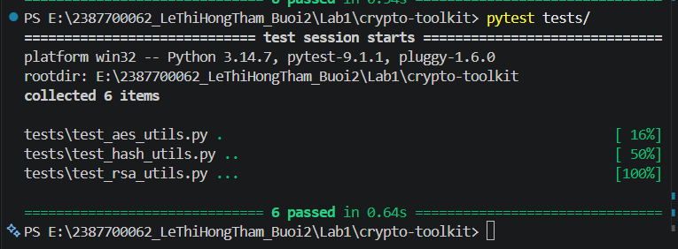
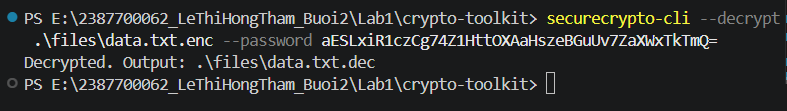
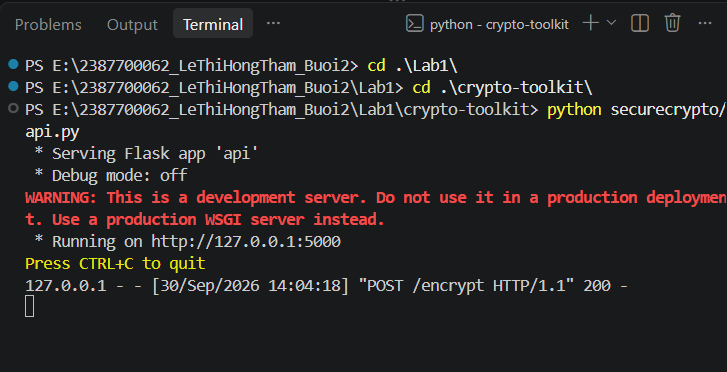
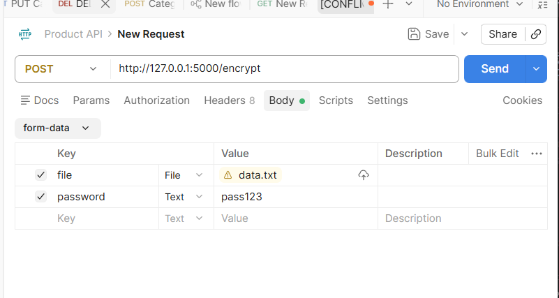
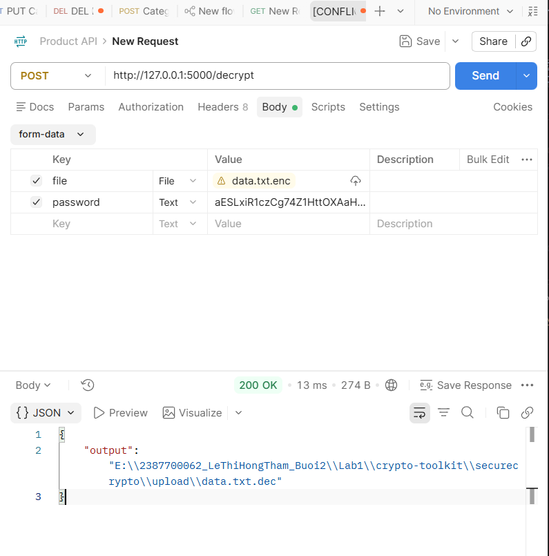
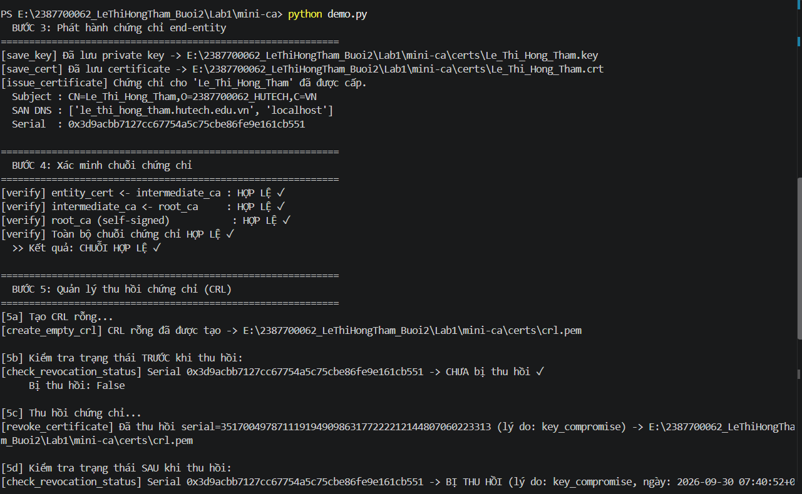
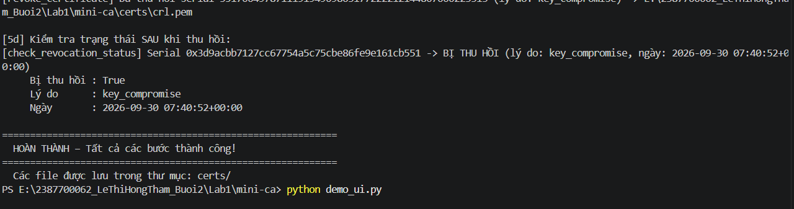
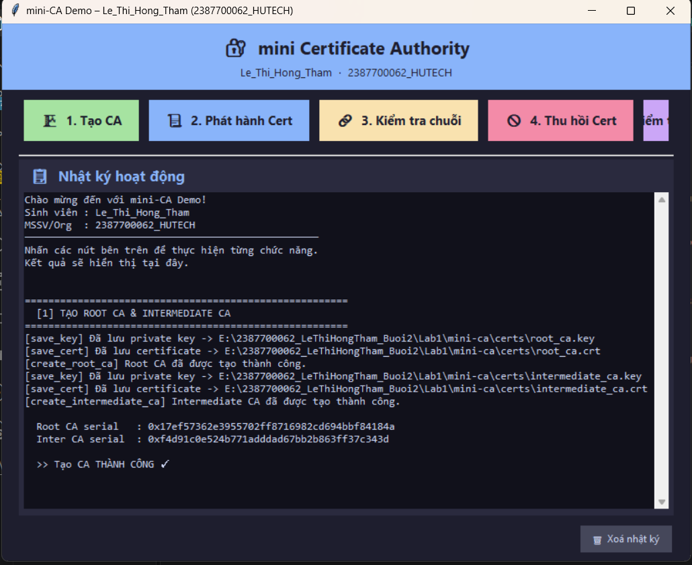
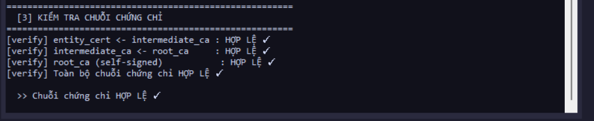
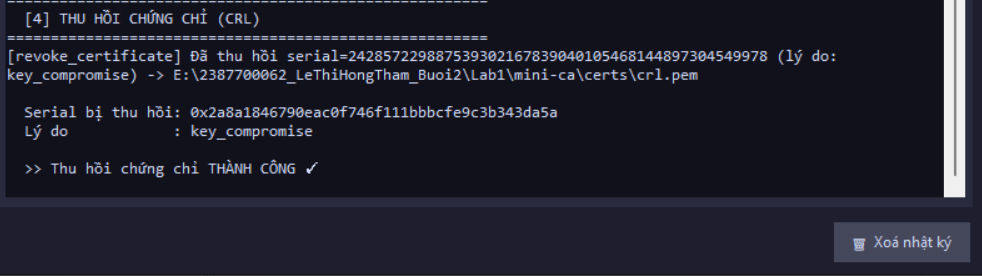

# BÁO CÁO THỰC HÀNH BUỔI 2: MÃ HOÁ VÀ TRIỂN KHAI PKI

| Thông tin | Chi tiết |
|-----------|----------|
| **Họ và tên** | Lê Thị Hồng Thắm |
| **MSSV** | 2387700062 |
| **Lớp** | 23DATA1 |
| **Trường** | Đại học Công nghệ TP.HCM (HUTECH) |
| **Ngày thực hành** | 30/09/2026 |

---

## PHẦN 1: THỰC HÀNH CRYPTOTOOLKIT — XÂY DỰNG THƯ VIỆN MẬT MÃ

### 1. Mục tiêu

Xây dựng thư viện mật mã `securecrypto` hoàn chỉnh hỗ trợ các tính năng:

- Mã hóa và giải mã file an toàn bằng thuật toán đối xứng **AES-256-GCM**.
- Băm mật khẩu bảo mật cao sử dụng **Argon2**.
- Khởi tạo cặp khóa, ký số và xác thực chữ ký dữ liệu bằng hệ mật mã bất đối xứng **RSA**.
- Tích hợp các chức năng trên vào **giao diện dòng lệnh (CLI)**, **giao diện đồ họa (GUI)** và **ứng dụng web API** bằng Flask.

---

### 2. Minh chứng thực hành

#### 2.1. Vượt qua các bài kiểm thử đơn vị (Unit Tests)

Chạy lệnh `pytest tests/` trong thư mục dự án `crypto-toolkit`. Toàn bộ **6 test case** cho ba module:
- `tests/test_aes_utils.py` — kiểm thử AES-256-GCM
- `tests/test_hash_utils.py` — kiểm thử Argon2 password hashing
- `tests/test_rsa_utils.py` — kiểm thử sinh khóa và ký số RSA

đều được thực thi thành công, đạt kết quả **6 passed in 0.64s** trên môi trường Python 3.14.7, pytest-9.1.1, pluggy-1.6.0.



---

#### 2.2. Mã hóa file bằng giao diện dòng lệnh (CLI — Encrypt)

Sử dụng công cụ `securecrypto-cli` với tham số `--encrypt` để mã hóa file `.\files\data.txt` bằng mật khẩu `pass123`. Hệ thống trả về chuỗi **key Base64** xác nhận quá trình mã hóa thành công:

```
aESLxiR1czCg74Z1HttOXAaHszeBGuUv7ZaXWxTkTmQ=
```


---

#### 2.3. Giải mã file bằng giao diện dòng lệnh (CLI — Decrypt)

Tiếp tục sử dụng `securecrypto-cli` với tham số `--decrypt`, truyền vào file `.\files\data.txt.enc` và key Base64 vừa nhận được. Hệ thống phản hồi:

```
Decrypted. Output: .\files\data.txt.dec
```

Xác nhận file gốc được khôi phục thành công tại `data.txt.dec`.



---

#### 2.4. Khởi động giao diện đồ họa (GUI)

Thực thi lệnh `python securecrypto/app_gui.py`. Ứng dụng GUI **SecureCrypto GUI** khởi động thành công với cửa sổ tkinter hiển thị ô nhập mật khẩu và hai nút thao tác **Encrypt** / **Decrypt**.


---

#### 2.5. Khởi động Flask API Server

Chạy lệnh `python securecrypto/api.py` để khởi tạo máy chủ Flask. Server lắng nghe tại địa chỉ `http://127.0.0.1:5000`. Log terminal ghi nhận request thực tế:

```
POST /encrypt HTTP/1.1  200
```

cho thấy API đang hoạt động và phản hồi đúng HTTP 200 OK.



---

#### 2.6. Gọi API Encrypt qua Postman

Gửi request **POST** tới `http://127.0.0.1:5000/encrypt` dưới dạng `form-data` với hai tham số:
- `file` → `data.txt`
- `password` → `pass123`

Hệ thống phản hồi **200 OK** (92ms, 222B) kèm body JSON:

```json
{
  "key": "aESLxiR1czCg74Z1HttOXAaHszeBGuUv7ZaXWxTkTmQ="
}
```

| Trường | Mô tả |
|--------|-------|
| `key` | Chuỗi khóa AES mã hóa Base64 dùng để giải mã |




---

#### 2.7. Gọi API Decrypt qua Postman

Gửi request **POST** tới `http://127.0.0.1:5000/decrypt` với:
- `file` → `data.txt.enc`
- `password` → chuỗi Base64 key từ bước mã hóa

Hệ thống phản hồi **200 OK** (13ms, 274B) kèm body JSON chứa đường dẫn file đã giải mã:

```json
{
  "output": "E:\\2387700062_LeThiHongTham_Buoi2\\Lab1\\crypto-toolkit\\securecrypto\\upload\\data.txt.dec"
}
```




---

## PHẦN 2: THỰC HÀNH CERTIFICATE AUTHORITY — MINI-CA

### 1. Mục tiêu

Triển khai hạ tầng khóa công khai (PKI) thu nhỏ để quản lý vòng đời chứng chỉ số:

- Khởi tạo **Root CA** tự ký (self-signed) và **Intermediate CA**.
- Phát hành chứng chỉ số định dạng **X.509** cho End-entity (người dùng cuối).
- Kiểm tra tính toàn vẹn của **chuỗi chứng chỉ** (Chain of Trust).
- **Thu hồi chứng chỉ** (Revoke) và cập nhật danh sách thu hồi **CRL**, kiểm tra trạng thái trực tuyến **OCSP**.

---

### 2. Minh chứng thực hành

#### 2.1. Bước 1 & 2 — Tạo Root CA và Intermediate CA (`demo.py`)

Chạy lệnh `python demo.py`, script khởi tạo tuần tự:

**Bước 1 — Root CA:**
```
Subject : CN=Root-CA-Le_Thi_Hong_Tham,O=2387700062_HUTECH,C=VN
Serial  : 0x581c9ceafefac592dbf2d7371b5d79c786e8c649
Hạn dùng: 2036-09-27 07:40:52+00:00
```

**Bước 2 — Intermediate CA:**
```
Subject : CN=Intermediate-CA-Le_Thi_Hong_Tham,O=2387700062_HUTECH,C=VN
Issuer  : CN=Root-CA-Le_Thi_Hong_Tham,O=2387700062_HUTECH,C=VN
Serial  : 0x340c15d4439a7fb19202fe7dba53506bd980389c
```

Cả hai file khóa (`.key`) và chứng chỉ (`.crt`) được lưu thành công vào thư mục `certs/`.


---

#### 2.2. Bước 3 — Phát hành chứng chỉ End-entity

Chứng chỉ X.509 được phát hành cho **Lê Thị Hồng Thắm**:

```
Subject : CN=Le_Thi_Hong_Tham,O=2387700062_HUTECH,C=VN
SAN DNS : ['le_thi_hong_tham.hutech.edu.vn', 'localhost']
Serial  : 0x3d9acbb7127cc67754a5c75cbe86fe9e161cb551
```

Hạn sử dụng chứng chỉ: **365 ngày** kể từ ngày phát hành.  
File lưu: `certs/Le_Thi_Hong_Tham.key` và `certs/Le_Thi_Hong_Tham.crt`.



---

#### 2.3. Bước 4 & 5 — Xác minh chuỗi và Thu hồi chứng chỉ

**Bước 4 — Xác minh chuỗi tin cậy:**
```
[verify] entity_cert   <- intermediate_ca : HỢP LỆ ✓
[verify] intermediate_ca <- root_ca       : HỢP LỆ ✓
[verify] root_ca (self-signed)            : HỢP LỆ ✓
[verify] Toàn bộ chuỗi chứng chỉ HỢP LỆ ✓
```

**Bước 5 — Quản lý CRL:**
- `[5b]` Kiểm tra trước: `CHƯA bị thu hồi ✓`
- `[5c]` Thu hồi với lý do `key_compromise` → cập nhật `certs/crl.pem`
- `[5d]` Kiểm tra sau: `BỊ THU HỒI — lý do: key_compromise, ngày: 2026-09-30 07:40:52+00:00`

Kết quả cuối cùng: **HOÀN THÀNH — Tất cả các bước thành công!**



---

#### 2.4. Giao diện Mini-CA — Khởi động (`demo_ui.py`)

Chạy lệnh `python demo_ui.py`, ứng dụng tkinter **mini Certificate Authority** khởi động với:
- Tiêu đề: `mini-CA Demo – Le_Thi_Hong_Tham (2387700062_HUTECH)`
- 5 nút chức năng: **Tạo CA · Phát hành Cert · Kiểm tra chuỗi · Thu hồi Cert · Kiểm tra OCSP**
- Khu vực **Nhật ký hoạt động** hiển thị log real-time


---

#### 2.5. GUI — Nhấn nút "Tạo CA"

Sau khi nhấn nút **1. Tạo CA**, nhật ký ghi nhận:
```
[create_root_ca] Root CA đã được tạo thành công.
Root CA serial  : 0x17ef57362e3955702ff8716982cd694bbf84184a
Inter CA serial : 0xf4d91c0e524b771adddad67bb2b863ff37c343d
>> Tạo CA THÀNH CÔNG ✓
```

Cả Root CA lẫn Intermediate CA được tạo và lưu file đồng thời trong một thao tác duy nhất.



---

#### 2.6. GUI — Nhấn nút "Phát hành Cert"

Nhấn nút **2. Phát hành Cert**, hệ thống phát hành chứng chỉ X.509 cho `Le_Thi_Hong_Tham`:
```
Subject : CN=Le_Thi_Hong_Tham,O=2387700062_HUTECH,C=VN
SAN DNS : ['le_thi_hong_tham.hutech.edu.vn', 'localhost']
Serial  : 0x2a8a1846790eac0f746f111bbbcfe9c3b343da5a
Hạn dùng: 2027-09-30 07:42:44+00:00
>> Phát hành chứng chỉ THÀNH CÔNG ✓
```


---

#### 2.7. GUI — Nhấn nút "Kiểm tra chuỗi"

Nhấn nút **3. Kiểm tra chuỗi**, kết quả xác minh toàn bộ chuỗi 3 tầng:
```
[verify] entity_cert   <- intermediate_ca : HỢP LỆ ✓
[verify] intermediate_ca <- root_ca       : HỢP LỆ ✓
[verify] root_ca (self-signed)            : HỢP LỆ ✓
>> Chuỗi chứng chỉ HỢP LỆ ✓
```



---

#### 2.8. GUI — Nhấn nút "Thu hồi Cert"

Nhấn nút **4. Thu hồi Cert**, hệ thống cập nhật CRL:
```
[revoke_certificate] Đã thu hồi serial=24285722988753930216783904010546814489730454978
(lý do: key_compromise) -> certs/crl.pem
Serial bị thu hồi : 0x2a8a1846790eac0f746f111bbbcfe9c3b343da5a
Lý do             : key_compromise
>> Thu hồi chứng chỉ THÀNH CÔNG ✓
```



---

#### 2.9. GUI — Nhấn nút "Kiểm tra OCSP"

Nhấn nút **5. Kiểm tra OCSP** (mô phỏng), hệ thống truy vấn CRL và báo cáo:
```
Serial  : 0x2a8a1846790eac0f746f111bbbcfe9c3b343da5a
Thu hồi : CÓ ✗
Lý do   : key_compromise
Ngày    : 2026-09-30 07:43:01+00:00
```

Xác nhận chứng chỉ đã bị đưa vào danh sách thu hồi và không còn hợp lệ.


---

## Tổng kết

| Phần | Nội dung | Kết quả |
|------|----------|---------|
| **Lab 1** | Unit Test (AES, Argon2, RSA) | ✅ 6/6 passed |
| **Lab 1** | CLI Encrypt / Decrypt | ✅ Thành công |
| **Lab 1** | GUI SecureCrypto | ✅ Khởi động OK |
| **Lab 1** | Flask API `/encrypt` | ✅ HTTP 200 + key Base64 |
| **Lab 1** | Flask API `/decrypt` | ✅ HTTP 200 + file giải mã |
| **Lab 2** | Tạo Root CA & Intermediate CA | ✅ Thành công |
| **Lab 2** | Phát hành chứng chỉ X.509 | ✅ CN=Le_Thi_Hong_Tham |
| **Lab 2** | Xác minh chuỗi (Chain of Trust) | ✅ 3/3 tầng hợp lệ |
| **Lab 2** | Thu hồi CRL (key_compromise) | ✅ crl.pem cập nhật |
| **Lab 2** | Kiểm tra OCSP | ✅ Phát hiện đúng trạng thái Revoked |

> **Bài thực hành đã được hoàn thành trọn vẹn**, đáp ứng toàn bộ các yêu cầu về mã hóa dữ liệu hiện đại và nắm vững quy trình vận hành hệ thống cấp phát, quản lý chứng chỉ số PKI thực tế.
